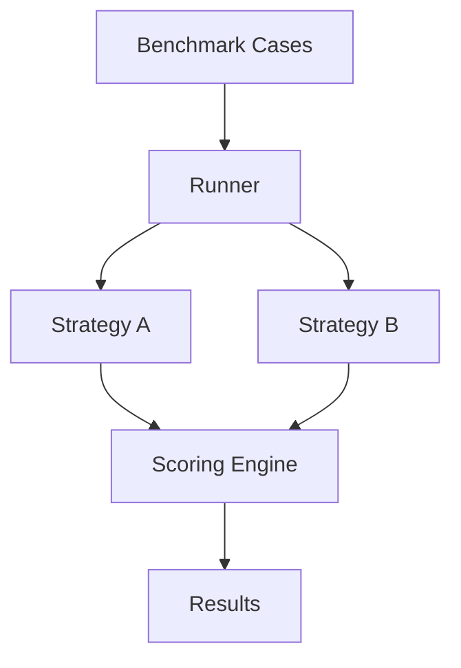

# ModelBench


ModelBench is a lightweight benchmarking harness for prompts, model strategies, and agent pipelines.

It allows developers to define benchmark cases, run multiple strategies, and compare outputs with simple scoring.

## Why this exists

Most AI developers test prompts and agent flows manually.

That makes it hard to:

- compare strategies consistently
- track regressions
- evaluate output quality
- repeat experiments

ModelBench provides a structured way to evaluate strategies over the same test set.

## Quick Start

```bash
git clone https://github.com/joshuamlamerton/modelbench
cd modelbench
python examples/demo.py
```

## Demo

The demo shows:

- a benchmark dataset with multiple questions
- two strategies competing on the same cases
- a scoring system
- printed benchmark results

## Architecture



## Repository Structure

```text
modelbench

README.md
LICENSE

docs
  architecture.md

core
  benchmark.py
  runner.py
  metrics.py

examples
  demo.py

tests
  test_basic.py
```

## Roadmap

Phase 1  
Exact-match benchmarking

Phase 2  
Semantic similarity scoring

Phase 3  
CLI and dataset loading

Phase 4  
Agent pipeline benchmarking

## License

Apache 2.0
